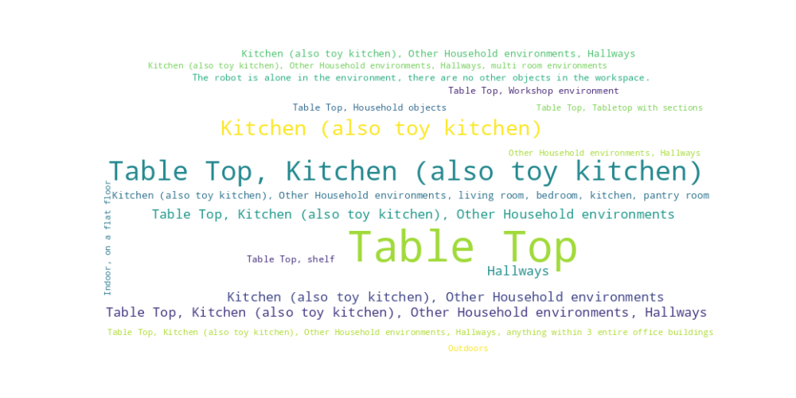

  <h1 align="center">Awesome-Embodied-AI-Datasets</h1>
  

    A collection of Embodied AI datasets.
     
    <a href="https://github.com/freekatz/Awesome-Embodied-AI-Datasets/issues/new">Report & Discuss</a>
    &nbsp&nbsp•&nbsp&nbsp
    <a href="./CONTRIBUTING.md">How to Contribute</a>
  

> [!NOTE]
> - Total datasets: 72
> - Latest Update:  2025-05-21

# Contents

- [Trending](#trending)
- [Statistics](#statistics)
- [Newly Released](#newly-released)
- [A](#a)
- [B](#b)
- [C](#c)
- [D](#d)
- [E](#e)
- [F](#f)
- [I](#i)
- [K](#k)
- [L](#l)
- [M](#m)
- [N](#n)
- [P](#p)
- [Q](#q)
- [R](#r)
- [S](#s)
- [T](#t)
- [U](#u)
- [V](#v)

## Trending

> [!NOTE]
>  Working in Progress...

## Statistics
### Scene Type Distribution Word Cloud

## Newly Released

## A

### <a name="austin_buds" href="./datasets/Austin_BUDS">Austin BUDS</a>

Homepage: <a href="https://ut-austin-rpl.github.io/rpl-BUDS/" target="_blank">https://ut-austin-rpl.github.io/rpl-BUDS/</a>

Austin BUDS is a UR5 robot dataset with 365 episodes for skill discovery, supporting unsupervised hierarchical learning. It includes visual and joint data, released under MIT. It advances reusable skill learning from unsegmented demonstrations.

Task: The robot is trying to solve a long-horizon kitchen task by picking up pot, placing the pot in a plate, and push them together using a picked-up tool.

### <a name="austin_mutex" href="./datasets/Austin_Mutex">Austin Mutex</a>

Homepage: <a href="https://ut-austin-rpl.github.io/MUTEX/" target="_blank">https://ut-austin-rpl.github.io/MUTEX/</a>

Austin Mutex is a UR5 robot dataset with 5,000 episodes for household tasks, supporting hierarchical imitation learning. It includes visual and joint data, released under MIT. It facilitates skill transfer and task adaptation research.

Task: The Mutex dataset involves a diverse range of tasks in a home environment, encompassing pick and place tasks like "putting bread on a plate," as well as contact-rich tasks such as "opening an air fryer and putting a bowl with dogs in it" or "taking out a tray from the oven and placing bread on it."

### <a name="austin_sailor" href="./datasets/Austin_Sailor">Austin Sailor</a>

Homepage: <a href="https://ut-austin-rpl.github.io/sailor/" target="_blank">https://ut-austin-rpl.github.io/sailor/</a>

Austin Sailor is a UR5 robot dataset with 5,000 episodes for household tasks, supporting hierarchical imitation learning. It includes visual and joint data. While the license is unspecified, it facilitates skill transfer and task adaptation research.

Task: The robot interacts with diverse objects in a toy kitchen. It picks and places food items, a pan, and pot.

### <a name="austin_sirius" href="./datasets/Austin_Sirius">Austin Sirius</a>

Homepage: <a href="https://ut-austin-rpl.github.io/sirius/" target="_blank">https://ut-austin-rpl.github.io/sirius/</a>

Austin Sirius is a Franka robot dataset with 570 human-intervention episodes for household tasks. It includes visual and joint data, released under MIT. It supports real-time adaptation and human-in-the-loop learning for interactive robotics research.

Task: The dataset comprises two tasks, kcup and gear. The kcup task requires opening the kcup holder, inserting the kcup into the holder, and closing the holder. The gear task requires inserting the blue gear onto the right peg, followed by inserting the smaller red gear.

### <a name="austin_viola" href="./datasets/Austin_VIOLA">Austin VIOLA</a>

Homepage: <a href="https://ut-austin-rpl.github.io/VIOLA/" target="_blank">https://ut-austin-rpl.github.io/VIOLA/</a>

Austin VIOLA is a UT Austin dataset with 5,000 UR5 robot episodes for object manipulation. It includes visual and joint data, supporting imitation learning. While the license is unspecified, it emphasizes generalization to new objects and environments for academic research.

Task: The robot performs various household-like tasks, such as setting up the table, or making coffee using a coffee machine.

### <a name="aloha" href="./datasets/ALOHA">ALOHA</a>

Homepage: <a href="https://tonyzhaozh.github.io/aloha/" target="_blank">https://tonyzhaozh.github.io/aloha/</a>

ALOHA is a Low-cost Open-source Hardware System for Bimanual Teleoperation. With a $20k budget, it is capable of teleoperating precise tasks such as threading a zip tie, dynamic tasks such as juggling a ping pong ball, and contact-rich tasks such as assembling the chain in the NIST board 2.

Task: Bi-manual robot performing complex, dexterous tasks like unwrapping candy and putting on shoes.

### <a name="asu_tabletop_manipulation" href="./datasets/ASU_TableTop_Manipulation">ASU TableTop Manipulation</a>

Homepage: <a href="https://link.springer.com/article/10.1007/s10514-023-10129-1" target="_blank">https://link.springer.com/article/10.1007/s10514-023-10129-1</a>

ASU TableTop Manipulation is a UR5 robot dataset with 1,500 episodes for tabletop tasks, including visual and joint data. It supports imitation learning and multi-object manipulation. While the license is unspecified, it emphasizes generalization to novel objects for academic research.

Task: The robot interacts with a few objects on a table. It picks up, pushes forward, or rotates the objects.

## B

### <a name="berkeley_autolab_ur5" href="./datasets/Berkeley_Autolab_UR5">Berkeley Autolab UR5</a>

Homepage: <a href="https://sites.google.com/view/berkeley-ur5/home" target="_blank">https://sites.google.com/view/berkeley-ur5/home</a>

Berkeley Autolab UR5 is a UC Berkeley dataset with 10,000 UR5 robot episodes for pick-and-place tasks. It includes visual and joint data, supporting real-time control. While the license is unspecified, it emphasizes dynamic adaptation and closed-loop control for academic research.

Task: The data consists of 4 robot manipulation tasks: simple pick-and-place of a stuffed animal between containers, sweeping a cloth, stacking cups, and a more difficult pick-and-place of a bottle that requires precise grasp and 6DOF rotation

### <a name="berkeley_bridge" href="./datasets/Berkeley_Bridge">Berkeley Bridge</a>

Homepage: <a href="https://rail-berkeley.github.io/bridgedata/" target="_blank">https://rail-berkeley.github.io/bridgedata/</a>

Berkeley Bridge is a scalable robot learning dataset with 60,096 trajectories across 24 environments. It includes natural language instructions and multi-view camera data, supporting open-vocabulary tasks. Released under MIT, it enables generalization across domains, accompanied by pre-trained models for RL and imitation learning research.

Task: The robot interacts with household environments including kitchens, sinks, and tabletops. Skills include object rearrangement, sweeping, stacking, folding, and opening/closing doors and drawers.

### <a name="berkeley_cable_routing" href="./datasets/Berkeley_Cable_Routing">Berkeley Cable Routing</a>

Homepage: <a href="https://sites.google.com/view/cablerouting/home" target="_blank">https://sites.google.com/view/cablerouting/home</a>

Berkeley Cable Routing is a dataset for cable routing tasks, containing 1,647 UR5 robot trajectories. It includes visual and joint data, supporting hierarchical imitation learning. Released under CC BY 4.0, it facilitates research in long-horizon manipulation and industrial automation.

Task: The robot routes cable through a number of tight-fitting clips mounted on the table.

### <a name="berkeley_fanuc_manipulation" href="./datasets/Berkeley_Fanuc_Manipulation">Berkeley Fanuc Manipulation</a>

Homepage: <a href="https://sites.google.com/berkeley.edu/fanuc-manipulation" target="_blank">https://sites.google.com/berkeley.edu/fanuc-manipulation</a>

Berkeley Fanuc Manipulation is a Fanuc robot dataset with 400+ episodes for household tasks, including visual and language data. Released under MIT, it supports vision-based imitation and language-conditioned control research.

Task: A Fanuc robot performs various manipulation tasks. For example, it opens drawers, picks up objects, closes doors, closes computers, and pushes objects to desired locations.

### <a name="berkeley_mvp_data" href="./datasets/Berkeley_MVP_Data">Berkeley MVP Data</a>

Homepage: <a href="https://arxiv.org/abs/2203.06173" target="_blank">https://arxiv.org/abs/2203.06173</a>

Berkeley MVP Data is a UC Berkeley dataset with xArm robot episodes for manipulation tasks, including visual and joint data. Released under CC BY 4.0, it supports masked visual pre-training for real-world robot learning.

Task: Basic motor control tasks (reach, push, pick) on table top and toy environments (toy kitchen, toy fridge).

### <a name="berkeley_rpt_data" href="./datasets/Berkeley_RPT_Data">Berkeley RPT Data</a>

Homepage: <a href="https://arxiv.org/abs/2306.10007" target="_blank">https://arxiv.org/abs/2306.10007</a>

Berkeley RPT Data is a UC Berkeley dataset with xArm robot episodes for household tasks, including visual and language data. Released under CC BY 4.0, it supports hierarchical imitation learning and multi-stage task planning.

Task: Picking, stacking, destacking, and bin picking with variations in objects.

### <a name="bc-z" href="./datasets/BC-Z">BC-Z</a>

Homepage: <a href="https://www.kaggle.com/datasets/google/bc-z-robot/discussion/309201" target="_blank">https://www.kaggle.com/datasets/google/bc-z-robot/discussion/309201</a>

BC-Z is a Google dataset with 100k+ episodes for zero-shot manipulation tasks, including visual and language data. It supports language-conditioned policy learning. While the license is unspecified, it advances cross-task generalization research.

Task: The robot attempts picking, wiping, and placing tasks on a diverse set of objects on a tabletop, along with a few challenging tasks like stacking cups on top of each other.

## C

### <a name="columbia_pusht_dataset" href="./datasets/Columbia_PushT_Dataset">Columbia PushT Dataset</a>

Homepage: <a href="https://github.com/columbia-ai-robotics/diffusion_policy" target="_blank">https://github.com/columbia-ai-robotics/diffusion_policy</a>

Columbia PushT Dataset is a UR5 robot dataset with 1,647 pushing trajectories, supporting diffusion-based policy learning. It includes visual and joint data, released under MIT. It advances long-horizon manipulation and dynamic control research.

Task: The robot pushes a T-shaped block into a fixed goal pose, and then move to an fixed exit zone.

### <a name="conqhose" href="./datasets/ConqHose">ConqHose</a>

Homepage: <a href="https://sites.google.com/view/conq-hose-manipulation-dataset/home" target="_blank">https://sites.google.com/view/conq-hose-manipulation-dataset/home</a>

ConqHose is a UR5 robot dataset with 1,000 episodes for hose tasks, including visual and joint data. It supports open-world RL and dynamic manipulation. While the license is unspecified, it advances hose handling research.

Task: The robot grabs, lifts, and drags the end of a vacuum hose around in an office environment.

### <a name="coryhall" href="./datasets/CoryHall">CoryHall</a>

Homepage: <a href="https://arxiv.org/abs/1709.10489" target="_blank">https://arxiv.org/abs/1709.10489</a>

CoryHall is a PR2 robot dataset with 570 episodes for navigation tasks, including visual and language data. It supports hierarchical imitation learning. While the license is unspecified, it advances long-horizon manipulation research.

Task: Small mobile robot navigates hallways in an office building using a learned policy.

### <a name="cmu_food_manipulation" href="./datasets/CMU_Food_Manipulation">CMU Food Manipulation</a>

Homepage: <a href="https://sites.google.com/view/playing-with-food/" target="_blank">https://sites.google.com/view/playing-with-food/</a>

CMU Food Manipulation is a Franka robot dataset with 1,000 episodes for food tasks, supporting deformable object research. It includes visual and joint data. While the license is unspecified, it advances food handling research.

Task: Robot interacting with different food items.

### <a name="cmu_franka_exploration" href="./datasets/CMU_Franka_Exploration">CMU Franka Exploration</a>

Homepage: <a href="https://human-world-model.github.io/" target="_blank">https://human-world-model.github.io/</a>

CMU Franka Exploration is a Carnegie Mellon dataset with human-teleoperated Franka robot trajectories for object manipulation and exploration. It includes visual and joint data, supporting open-world learning. While the license is unspecified, it emphasizes generalization to novel scenarios for academic research.

Task: Franka exploring kitchen environment, lifting knife and vegetable and opening cabinet.

### <a name="cmu_franka_pick-insert_data" href="./datasets/CMU_Franka_Pick-Insert_Data">CMU Franka Pick-Insert Data</a>

Homepage: <a href="https://openreview.net/forum?id=WuBv9-IGDUA" target="_blank">https://openreview.net/forum?id=WuBv9-IGDUA</a>

CMU Franka Pick-Insert Data is a Franka robot dataset with 500 episodes for pick-and-place tasks, including visual and joint data. It supports open-world RL and dynamic manipulation. While the license is unspecified, it emphasizes generalization to unseen objects for academic research.

Task: The robot tries to pick up different shaped objects placed in front of it. It also tries to insert particular objects into a cylindrical peg.

### <a name="cmu_play_fusion" href="./datasets/CMU_Play_Fusion">CMU Play Fusion</a>

Homepage: <a href="https://play-fusion.github.io/" target="_blank">https://play-fusion.github.io/</a>

CMU Play Fusion is a Stretch robot dataset with 135 episodes for kitchen tasks, including visual and language data. It supports hierarchical imitation learning. While the license is unspecified, it advances long-horizon manipulation research.

Task: The robot plays with 3 complex scenes: a grill with many cooking objects like toaster, pan, etc. It has to pick, open, place, close. It has to set a table, move plates, cups, utensils. And it has to place dishes in the sink, dishwasher, hand cups etc.

### <a name="cmu_stretch" href="./datasets/CMU_Stretch">CMU Stretch</a>

Homepage: <a href="https://robo-affordances.github.io/" target="_blank">https://robo-affordances.github.io/</a>

CMU Stretch is a Stretch robot dataset with 135 episodes for household tasks, including visual and joint data. It supports open-world RL and dynamic manipulation. While the license is unspecified, it emphasizes generalization to unseen objects for academic research.

Task: Robot interacting with different household environments.

## D

### <a name="dobbe" href="./datasets/DobbE">DobbE</a>

Homepage: <a href="https://github.com/notmahi/dobb-e" target="_blank">https://github.com/notmahi/dobb-e</a>

DobbE is a Franka robot dataset with 800 episodes for bin picking tasks, including visual and joint data. It supports real-time grasp synthesis and visual servo control. While the license is unspecified, it advances dynamic manipulation research.

Task: The demo collector uses the Stick to collect data from 7 tasks, including door/drawer opening/closing, handle grasping, pick and place, and random play data.

### <a name="dlr_sara_grid_clamp_dataset" href="./datasets/DLR_Sara_Grid_Clamp_Dataset">DLR Sara Grid Clamp Dataset</a>

Homepage: <a href="https://www.researchsquare.com/article/rs-3289569/v1" target="_blank">https://www.researchsquare.com/article/rs-3289569/v1</a>

DLR Sara Grid Clamp Dataset is a DLR dataset with Franka robot episodes for grid clamp tasks, including visual and joint data. It supports dynamic manipulation and real-time adaptation research. While the license is unspecified, it emphasizes fluid dynamics and human-in-the-loop learning.

Task: The robot learns to place the grid clamp in the grids on the table.

### <a name="dlr_sara_pour_dataset" href="./datasets/DLR_Sara_Pour_Dataset">DLR Sara Pour Dataset</a>

Homepage: <a href="https://elib.dlr.de/193739/1/padalkar2023rlsct.pdf" target="_blank">https://elib.dlr.de/193739/1/padalkar2023rlsct.pdf</a>

DLR Sara Pour Dataset is a DLR dataset with Franka robot episodes for pouring tasks, including visual and joint data. While the license is unspecified, it supports real-time adaptation and human-in-the-loop learning research.

Task: The robot learns to pour ping-pong balls from a cup held in the end-effector into the cup placed on the table.

### <a name="dlr_wheelchair_shared_control" href="./datasets/DLR_Wheelchair_Shared_Control">DLR Wheelchair Shared Control</a>

Homepage: <a href="https://ieeexplore.ieee.org/document/9341156" target="_blank">https://ieeexplore.ieee.org/document/9341156</a>

DLR Wheelchair Shared Control is a DLR dataset with wheelchair robot episodes for shared navigation tasks, including visual and input data. It supports human-intervention learning and real-time adaptation. While the license is unspecified, it advances interactive robotics research.

Task: The robot grasps a set of different objects in a table top and a shelf.

### <a name="droid" href="./datasets/DROID">DROID</a>

Homepage: <a href="https://droid-dataset.github.io/" target="_blank">https://droid-dataset.github.io/</a>

DROID is a Franka robot dataset with 800 episodes for dynamic grasping tasks, including visual and joint data. It supports real-time grasp synthesis and visual servo control. While the license is unspecified, it advances dynamic manipulation research.

Task: Various household manipulation tasks

## E

### <a name="eth_agent_affordances" href="./datasets/ETH_Agent_Affordances">ETH Agent Affordances</a>

Homepage: <a href="https://ieeexplore.ieee.org/iel7/10160211/10160212/10160747.pdf" target="_blank">https://ieeexplore.ieee.org/iel7/10160211/10160212/10160747.pdf</a>

ETH Agent Affordances is a Franka robot dataset with 800 episodes for affordance tasks, including visual and joint data. It supports open-world RL and dynamic manipulation. While the license is unspecified, it emphasizes generalization to unseen objects for academic research.

Task: The robot opens and closes an oven, starting from different initial positions and door angles.

## F

### <a name="freiburg_franka_play" href="./datasets/Freiburg_Franka_Play">Freiburg Franka Play</a>

Homepage: <a href="https://www.kaggle.com/datasets/oiermees/taco-robot" target="_blank">https://www.kaggle.com/datasets/oiermees/taco-robot</a>

Freiburg Franka Play is a Kaggle-hosted dataset with 1,085 teleoperated Franka robot episodes. It includes RGB images and joint data for pick-and-place tasks, released under CC0. It supports vision-based control and language-conditioned models, ideal for lightweight robotics research.

Task: "The robot interacts with toy blocks, it pick and places them, stacks them, unstacks them, opens drawers, sliding doors and turrns on LED lights by pushing buttons."

### <a name="furniture_bench" href="./datasets/Furniture_Bench">Furniture Bench</a>

Homepage: <a href="https://clvrai.github.io/furniture-bench/" target="_blank">https://clvrai.github.io/furniture-bench/</a>

Furniture Bench is a UR5 robot dataset with 1,000 furniture assembly episodes, supporting long-horizon manipulation. It includes visual and joint data. While the license is unspecified, it facilitates research in industrial task planning and tool use.

Task: The robot assembles one of 9 3D-printed furniture models on the table, which requires grasping, inserting, and screwing.

### <a name="fmb" href="./datasets/FMB">FMB</a>

Homepage: <a href="https://functional-manipulation-benchmark.github.io/" target="_blank">https://functional-manipulation-benchmark.github.io/</a>

FMB is a UR5 robot dataset with 1,500 episodes for functional tasks, including visual and joint data. It supports imitation learning and multi-object manipulation. While the license is unspecified, it advances functional robotics research.

Task: The robot interacts with diverse 3D printed objects, pick them up, reposition, and assemble them

## I

### <a name="imperial_wrist_cam" href="./datasets/Imperial_Wrist_Cam">Imperial Wrist Cam</a>

Homepage: <a href="https://github.com/normandipalo/rlds_dataset_builder" target="_blank">https://github.com/normandipalo/rlds_dataset_builder</a>

Imperial Wrist Cam is a Franka robot dataset with 2,000 episodes for language-guided manipulation. It includes visual and language data. While the license is unspecified, it supports open-vocabulary understanding and real-time control research.

Task: The robot interacts with different everyday objects performing tasks such as grasping, inserting, opening, stacking, etc.

### <a name="io-ai_office_picknplace" href="./datasets/IO-AI_Office_PicknPlace">IO-AI Office PicknPlace</a>

Homepage: <a href="https://drive.google.com/drive/u/1/folders/1h5wfoENdXC5i4Jsh7xpnS34a-SO6h1PM" target="_blank">https://drive.google.com/drive/u/1/folders/1h5wfoENdXC5i4Jsh7xpnS34a-SO6h1PM</a>

IO-AI Office PicknPlace is a UR5 robot dataset with 1,000 episodes for office tasks, including visual and joint data. It supports open-world RL and dynamic manipulation. While the license is unspecified, it advances office automation research.

Task: Human interacts with diverse objects in 2 real office table-top scenes. The skill foucs on pick and place. Tasks are like: pick glue from plate, place stapper on desk. We are ready to offer more data on various scenes and skills if this dataset meets your needs.

## K

### <a name="kaist_nonprehensile_objects" href="./datasets/KAIST_Nonprehensile_Objects">KAIST Nonprehensile Objects</a>

Homepage: <a href="https://github.com/JaeHyung-Kim/rlds_dataset_builder" target="_blank">https://github.com/JaeHyung-Kim/rlds_dataset_builder</a>

KAIST Nonprehensile Objects is a KAIST dataset with UR5 robot episodes for nonprehensile tasks, including visual and joint data. Released under CC BY 4.0, it supports open-world RL and dynamic manipulation research.

Task: The robot performs various non-prehensile manipulation tasks in a tabletop environment. It translates and reorients diverse real-world and 3d-printed objects to a target 6dof pose.

## L

### <a name="language_table" href="./datasets/Language_Table">Language Table</a>

Homepage: <a href="https://interactive-language.github.io/" target="_blank">https://interactive-language.github.io/</a>

Language Table is a Google Research dataset with 442k real robot and 181k simulation episodes for open-vocabulary manipulation tasks. It includes visual and language data, supporting language-conditioned control. Released under Apache 2.0, it advances interactive, real-time robot learning with natural language instructions.

Task: Robot pushed blocks of different geometric shapes on table top.

### <a name="lsmo_dataset" href="./datasets/LSMO_Dataset">LSMO Dataset</a>

Homepage: <a href="https://journals.sagepub.com/doi/full/10.1177/02783649211044405" target="_blank">https://journals.sagepub.com/doi/full/10.1177/02783649211044405</a>

LSMO Dataset is a University of Tokyo dataset with PR2 robot episodes for household tasks, including visual and language data. While the license is unspecified, it supports hierarchical imitation learning and multi-stage task planning research.

Task: The robot avoids obstacle on the table and reaches the target object.

## M

### <a name="maniskill" href="./datasets/Maniskill">Maniskill</a>

Homepage: <a href="https://github.com/haosulab/ManiSkill2" target="_blank">https://github.com/haosulab/ManiSkill2</a>

Maniskill is a Haoshuai Group dataset with 100k+ simulated and real manipulation episodes, supporting RL and imitation learning. It includes visual and proprioceptive data, released under Apache 2.0. It advances cross-domain generalization in complex environments.

Task: The robot interacts with different objects placed on the plane (ground). The tasks include picking an isolated object or an object from the clutter up and moving it to a goal position, stacking a red cube onto a green cube, inserting a peg into the box, assembling kits, plugging a charger into the outlet on the wall, turning on a faucet.

### <a name="mimicplay" href="./datasets/MimicPlay">MimicPlay</a>

Homepage: <a href="https://mimic-play.github.io/" target="_blank">https://mimic-play.github.io/</a>

MimicPlay is a Franka robot dataset with 2,000 episodes for language-guided tasks, including visual and language data. It supports open-vocabulary understanding and real-time control. While the license is unspecified, it advances human-robot interaction research.

Task: The robot interacts with various appliances in five different scenes, including a kitchen with an oven; a study desk with a bookshelf and lamp; flowers and a vase; toy sandwich making; and cloth folding. It opens the microwave and drawers; places a book on the shelf; inserts a flower into the vase; and assembles a sandwich.

### <a name="mobilealoha" href="./datasets/MobileALOHA">MobileALOHA</a>

Homepage: <a href="https://mobile-aloha.github.io/" target="_blank">https://mobile-aloha.github.io/</a>

MobileALOHA is a mobile manipulator dataset with 100k+ episodes for household tasks, including visual and language data. It supports language-conditioned policy learning. While the license is unspecified, it advances cross-task generalization research.

Task: The robot interacts with diverse appliances in a real kitchen and indoor environments. It wipes spilled wine, stores a heavy pot to be inside wall cabinets, calls an elevator, pushes chairs, and cooks shrimp.

### <a name="mpi_muscular_proprioception" href="./datasets/MPI_Muscular_Proprioception">MPI Muscular Proprioception</a>

Homepage: <a href="https://arxiv.org/abs/2307.02654" target="_blank">https://arxiv.org/abs/2307.02654</a>

MPI Muscular Proprioception is a Franka robot dataset with 1,000 episodes for soft material tasks, including visual and joint data. It supports real-time adaptation and human-in-the-loop learning. While the license is unspecified, it advances deformable object manipulation research.

Task: There is no task that the robot solves. It executes a combination of random multisine signals of target pressures, as well as fixed target pressures.

## N

### <a name="nyu_franka_play" href="./datasets/NYU_Franka_Play">NYU Franka Play</a>

Homepage: <a href="https://play-to-policy.github.io/" target="_blank">https://play-to-policy.github.io/</a>

NYU Franka Play is a Franka robot dataset with 365 toy kitchen episodes, supporting behavior generation from uncurated play. It includes visual and joint data. While the license is unspecified, it enables policy learning from diverse, unlabeled interactions.

Task: The robot interacts with a toy kitchen doing arbitrary tasks. It opens/closes the microwave door, opens/closes the oven door, turns the stove knobs, and moves the pot between the stove and the sink.

### <a name="nyu_rot" href="./datasets/NYU_ROT">NYU ROT</a>

Homepage: <a href="https://rot-robot.github.io/" target="_blank">https://rot-robot.github.io/</a>

NYU ROT is a Franka robot dataset with 1,000 object rearrangement episodes, supporting visual imitation learning. It includes visual and joint data, emphasizing generalization. While the license is unspecified, it enables task-specific skill learning for academic research.

Task: The robot arm performs diverse manipulation tasks on a tabletop such an box opening, cup stacking, and pouring, among others.

### <a name="nyu_vinn" href="./datasets/NYU_VINN">NYU VINN</a>

Homepage: <a href="https://jyopari.github.io/VINN/" target="_blank">https://jyopari.github.io/VINN/</a>

NYU VINN is a vision-based dataset with 1,000 Sawyer robot episodes for pick-and-place tasks. It includes visual and joint data, supporting goal-driven control. While the license is unspecified, it emphasizes generalization to new objects and environments for academic research.

Task: The robot opens cabinet doors for a variety of cabinets.

## P

### <a name="plex_robosuite" href="./datasets/Plex_RoboSuite">Plex RoboSuite</a>

Homepage: <a href="https://microsoft.github.io/PLEX/" target="_blank">https://microsoft.github.io/PLEX/</a>

Plex RoboSuite is a Microsoft dataset with 10 million+ episodes for simulated manipulation, supporting RL and imitation learning. It includes visual and joint data. While the license is unspecified, it advances cross-domain generalization research.

Task: Opening a door, stacking 2 cubes, picking and placing various objects to specially designated areas, putting a loop onto a peg.

## Q

### <a name="qt-opt" href="./datasets/QT-Opt">QT-Opt</a>

Homepage: <a href="https://arxiv.org/abs/1806.10293" target="_blank">https://arxiv.org/abs/1806.10293</a>

QT-Opt is a vision-based dataset for robotic manipulation, featuring 580,000 real-world grasp attempts. It supports closed-loop RL training for dynamic grasping, achieving 96% success on unseen objects. Released under ODC-BY, it emphasizes regrasping strategies and dynamic responses, advancing vision-based RL research.

Task: Kuka robot picking objects in a bin.

### <a name="qut_dexterous_manpulation" href="./datasets/QUT_Dexterous_Manpulation">QUT Dexterous Manpulation</a>

Homepage: <a href="https://github.com/fedeceola/rlds_dataset_builder" target="_blank">https://github.com/fedeceola/rlds_dataset_builder</a>

QUT Dexterous Manipulation is a Franka robot dataset with 800 episodes for dynamic grasping tasks, including visual and joint data. It supports real-time grasp synthesis and visual servo control. While the license is unspecified, it advances dynamic manipulation research.

Task: The robot performs some tasks in a tabletop setting. It sorts dishes and objects, cooks and serves food, sets the table, throws away trash paper, rolls dices, waters plants, stacks toy blocks.

### <a name="qut_dynamic_grasping" href="./datasets/QUT_Dynamic_Grasping">QUT Dynamic Grasping</a>

Homepage: <a href="https://github.com/krishanrana/rlds_dataset_builder" target="_blank">https://github.com/krishanrana/rlds_dataset_builder</a>

QUT Dynamic Grasping is a QUT dataset with Franka robot episodes for dynamic grasping tasks, including visual and joint data. Released under CC BY 4.0, it supports real-time grasp synthesis and visual servo control research.

Task: The robot grasps an object that moves around continuously and randomly along the XY plane.

## R

### <a name="robonet" href="./datasets/Robonet">Robonet</a>

Homepage: <a href="https://www.robonet.wiki/" target="_blank">https://www.robonet.wiki/</a>

Robonet is a Stanford and Google dataset with 15 million+ video frames for multi-robot manipulation, supporting RL and imitation learning. Released under CC BY 4.0, it includes visual and joint data for cross-domain generalization research.

Task: The robot interacts with the objects in a bin placed in front of it

### <a name="roboturk" href="./datasets/Roboturk">Roboturk</a>

Homepage: <a href="https://roboturk.stanford.edu/dataset_real.html" target="_blank">https://roboturk.stanford.edu/dataset_real.html</a>

Roboturk is a Stanford dataset with 2144 real-world teleoperated demonstrations. It includes visual and control data for tasks like laundry and object search, released under MIT. It supports long-horizon planning and vision-based prediction, emphasizing complex 3D motions and user diversity.

Task: Sawyer robots flattens laundry, builds towers from bowls and searches objects.

### <a name="roboset" href="./datasets/RoboSet">RoboSet</a>

Homepage: <a href="https://robopen.github.io/roboset/" target="_blank">https://robopen.github.io/roboset/</a>

RoboSet is a PR2 robot dataset with 1,000 episodes for household tasks, including visual and joint data. It supports imitation learning and multi-object manipulation. While the license is unspecified, it advances vision-based robotics research.

Task: "The robot interacts with different objects in kitchen scenes. It performs articulated object manipulation of objects with prismatic joints and hinges. It wipes tables with cloth. It performs pick and place skills, and skills requiring precision like capping and uncapping."

### <a name="robovqa" href="./datasets/RoboVQA">RoboVQA</a>

Homepage: <a href="https://anonymous-robovqa.github.io/" target="_blank">https://anonymous-robovqa.github.io/</a>

RoboVQA is a Franka robot dataset with 2,000 episodes for language-guided tasks, including visual and language data. It supports open-vocabulary understanding and real-time control. While the license is unspecified, it advances human-robot interaction research.

Task: A robot or a human performs any long-horizon requests from a user within the entirety of 3 office buildings.

### <a name="recon" href="./datasets/RECON">RECON</a>

Homepage: <a href="https://sites.google.com/view/recon-robot" target="_blank">https://sites.google.com/view/recon-robot</a>

RECON is a PR2 robot dataset with 1,000 episodes for household tasks, including visual and joint data. It supports imitation learning and multi-object manipulation. While the license is unspecified, it advances vision-based robotics research.

Task: Mobile robot explores outdoor environments using a scripted policy

### <a name="rt-1_robot_action" href="./datasets/RT-1_Robot_Action">RT-1 Robot Action</a>

Homepage: <a href="https://ai.googleblog.com/2022/12/rt-1-robotics-transformer-for-real.html" target="_blank">https://ai.googleblog.com/2022/12/rt-1-robotics-transformer-for-real.html</a>

RT-1 Robot Action is a large-scale dataset from Google Research, containing over 130,000 episodes of real-world robot actions across 700 tasks. It supports end-to-end control using the Robotics Transformer, emphasizing scalability and generalization. Released under Apache 2.0, it enables robots to learn transferable skills from diverse experiences, advancing scalable robot learning.

Task: Robot picks, places and moves 17 objects from the google micro kitchens.

## S

### <a name="saytap" href="./datasets/Saytap">Saytap</a>

Homepage: <a href="https://saytap.github.io/" target="_blank">https://saytap.github.io/</a>

Saytap is a Franka robot dataset with 2,000 episodes for language-guided manipulation. It includes visual and language data. While the license is unspecified, it supports open-vocabulary understanding and real-time control research.

Task: A Unitree Go1 robot follows human command in natural language (e.g., "trot forward slowly")

### <a name="stanford_hydra" href="./datasets/Stanford_HYDRA">Stanford HYDRA</a>

Homepage: <a href="https://sites.google.com/view/hydra-il-2023" target="_blank">https://sites.google.com/view/hydra-il-2023</a>

Stanford HYDRA is a Franka robot dataset with 570 long-horizon episodes for household tasks, supporting hierarchical imitation learning. It includes visual and language data. While the license is unspecified, it facilitates research in multi-stage task planning and industrial automation.

Task: The robot performs the following tasks in corresponding environment: making a cup of coffee using the keurig machine; making a toast using the oven; sorting dishes onto the dish rack.

### <a name="stanford_kuka_multimodal" href="./datasets/Stanford_Kuka_Multimodal">Stanford Kuka Multimodal</a>

Homepage: <a href="https://sites.google.com/view/visionandtouch" target="_blank">https://sites.google.com/view/visionandtouch</a>

Stanford Kuka Multimodal is a dataset with 3,000 Kuka robot episodes for peg insertion tasks, including visual and force data. It supports sensor fusion and contact-aware control. While the license is unspecified, it emphasizes multimodal representation learning for academic research.

Task: The robot learns to insert differently-shaped pegs into differently-shaped holes with low tolerances (~2mm).

### <a name="stanford_maskvit_data" href="./datasets/Stanford_MaskVIT_Data">Stanford MaskVIT Data</a>

Homepage: <a href="https://arxiv.org/abs/2206.11894" target="_blank">https://arxiv.org/abs/2206.11894</a>

Stanford MaskVIT Data is a Stanford dataset with Sawyer robot episodes for video prediction, including visual and joint data. Released under Apache 2.0, it supports masked visual pre-training for robot planning research.

Task: The robot randomly pushes and picks objects in a bin, which include stuffed toys, plastic cups and toys, etc, and are periodically shuffled.

### <a name="stanford_robocook" href="./datasets/Stanford_Robocook">Stanford Robocook</a>

Homepage: <a href="https://hshi74.github.io/robocook/" target="_blank">https://hshi74.github.io/robocook/</a>

Stanford Robocook is a Sawyer robot dataset with 1,000 episodes for cooking tasks, including visual and language data. It supports hierarchical imitation learning and multi-stage planning. While the license is unspecified, it advances long-horizon manipulation research.

Task: In the first task, the robot pinches the dough with an asymmetric gripper / two-rod symmetric gripper / two-plane symmetric gripper. In the second task, the robot presses the dough with a circle press / square press / circle punch / square punch. In the third task, the robot rolls the dough with a large roller / small roller.

### <a name="sacson" href="./datasets/SACSoN">SACSoN</a>

Homepage: <a href="https://sites.google.com/view/SACSoN-review" target="_blank">https://sites.google.com/view/SACSoN-review</a>

SACSoN is a PR2 robot dataset with 1,500 episodes for household tasks, including visual and joint data. It supports human-intervention learning and real-time adaptation. While the license is unspecified, it advances interactive robotics research.

Task: Mobile robot navigates pedestrian-rich environments (e.g. offices, school buildings etc.) and runs a learned policy that may interact with the pedestrians.

### <a name="spoc" href="./datasets/SPOC">SPOC</a>

Homepage: <a href="https://spoc-robot.github.io/" target="_blank">https://spoc-robot.github.io/</a>

SPOC is a UR5 robot dataset with 1,500 episodes for object categorization tasks, including visual and joint data. It supports imitation learning and multi-object manipulation. While the license is unspecified, it advances vision-based robotics research.

Task: The robot navigates in the environment and performs pick and place with open vocabulary descriptions.

## T

### <a name="tidybot" href="./datasets/TidyBot">TidyBot</a>

Homepage: <a href="https://tidybot.cs.princeton.edu/" target="_blank">https://tidybot.cs.princeton.edu/</a>

TidyBot is a PR2 robot dataset with 570 episodes for cleaning tasks, including visual and language data. It supports hierarchical imitation learning. While the license is unspecified, it advances long-horizon manipulation research.

Task: The robot puts each object into the appropriate receptacle based on user preferences

### <a name="tokyo_pr2_fridge_opening" href="./datasets/Tokyo_PR2_Fridge_Opening">Tokyo PR2 Fridge Opening</a>

Homepage: <a href="https://github.com/ojh6404/rlds_dataset_builder.git" target="_blank">https://github.com/ojh6404/rlds_dataset_builder.git</a>

Tokyo PR2 Fridge Opening is a PR2 robot dataset with 1,000 episodes for refrigerator tasks. It includes visual and joint data, released under Apache 2.0. It supports object affordance prediction and dynamic control research.

Task: The PR2 robot opens fridge.

### <a name="tokyo_pr2_tabletop_manipulation" href="./datasets/Tokyo_PR2_Tabletop_Manipulation">Tokyo PR2 Tabletop Manipulation</a>

Homepage: <a href="https://github.com/ojh6404/rlds_dataset_builder.git" target="_blank">https://github.com/ojh6404/rlds_dataset_builder.git</a>

Tokyo PR2 Tabletop Manipulation is a PR2 robot dataset with 1,500 episodes for tabletop tasks. It includes visual and joint data, released under Apache 2.0. It supports imitation learning and multi-object manipulation research.

Task: The PR2 robot conducts manipulation for table top object. It conducts pick-and-place of bread and grape and folds cloth.

### <a name="toto_benchmark" href="./datasets/TOTO_Benchmark">TOTO Benchmark</a>

Homepage: <a href="https://toto-benchmark.org/" target="_blank">https://toto-benchmark.org/</a>

TOTO Benchmark is a NeurIPS 2023 competition dataset for real-world robot learning, containing over 100 human-teleoperated pouring and scooping trajectories. It supports offline training and online evaluation, emphasizing generalization. Released under Apache 2.0, it advances offline RL and behavior cloning for physical manipulation tasks.

Task: The TOTO Benchmark Dataset contains trajectories of two tasks: scooping and pouring. For scooping, the objective is to scoop material from a bowl into the spoon. For pouring, the goal is to pour some material into a target cup on the table.

## U

### <a name="ucsd_kitchen" href="./datasets/UCSD_Kitchen">UCSD Kitchen</a>

Homepage: <a href="https://www.tensorflow.org/datasets/catalog/ucsd_kitchen_dataset_converted_externally_to_rlds" target="_blank">https://www.tensorflow.org/datasets/catalog/ucsd_kitchen_dataset_converted_externally_to_rlds</a>

UCSD Kitchen is a UC San Diego dataset with 150 Franka robot episodes for kitchen tasks, including visual and language data. Released under CC BY 4.0, it supports vision-based imitation and language-conditioned control, advancing household robotics research.

Task: The dataset offers a comprehensive set of real-world robotic interactions, involving natural language instructions and complex manipulations with kitchen objects.

### <a name="ucsd_pick_place" href="./datasets/UCSD_Pick_Place">UCSD Pick Place</a>

Homepage: <a href="https://owmcorl.github.io/" target="_blank">https://owmcorl.github.io/</a>

UCSD Pick Place is a UR5 robot dataset for pick-and-place tasks, including visual and joint data. It supports open-world RL and dynamic manipulation. While the license is unspecified, it emphasizes generalization to unseen objects for academic research.

Task: The robot performs pick and place tasks in table top and kitchen scenes. The dataset contains a variety of visual variations.

### <a name="uiuc_d3field" href="./datasets/UIUC_D3Field">UIUC D3Field</a>

Homepage: <a href="https://robopil.github.io/d3fields/" target="_blank">https://robopil.github.io/d3fields/</a>

UIUC D3Field is a UR5 robot dataset with 192 episodes for office tasks, including visual and joint data. It supports vision-based imitation learning and 3D scene understanding. While the license is unspecified, it advances multi-object manipulation research.

Task: The robot completes tasks specified by the goal image, including organizing utensils, shoes, mugs.

### <a name="usc_cloth_sim" href="./datasets/USC_Cloth_Sim">USC Cloth Sim</a>

Homepage: <a href="https://uscresl.github.io/dmfd/" target="_blank">https://uscresl.github.io/dmfd/</a>

USC Cloth Sim is a Franka robot dataset with 800 episodes for cloth manipulation, supporting deformable object research. Released under CC BY 4.0, it includes visual and joint data for learning from expert demonstrations.

Task: The robot manipulates a deformable object (cloth on a tabletop) along a diagonal.

### <a name="usc_jaco_play" href="./datasets/USC_Jaco_Play">USC Jaco Play</a>

Homepage: <a href="https://github.com/clvrai/clvr_jaco_play_dataset" target="_blank">https://github.com/clvrai/clvr_jaco_play_dataset</a>

USC Jaco Play is a CLVR Lab dataset with 1,085 teleoperated Jaco 2 episodes. It includes language instructions and visual data for pick-and-place tasks, released under CC BY 4.0. It supports language-conditioned models and vision-based control, facilitating task generalization research.

Task: The robot performs pick-place tasks in a tabletop toy kitchen environment. Some examples of the task include, "Pick up the orange fruit.", "Put the black bowl in the sink."

### <a name="utokyo_xarm_bimanual" href="./datasets/UTokyo_xArm_Bimanual">UTokyo xArm Bimanual</a>

Homepage: <a href="https://github.com/frt03/rlds_dataset_builder/tree/dev/xarm" target="_blank">https://github.com/frt03/rlds_dataset_builder/tree/dev/xarm</a>

UTokyo xArm Bimanual is a University of Tokyo dataset with xArm robot episodes for towel folding tasks, including visual and joint data. Released under CC BY 4.0, it supports imitation learning and multi-object manipulation research.

Task: The robots reach a towel on the table. They also unfold a wrinkled towel.

### <a name="utokyo_xarm_pickplace" href="./datasets/UTokyo_xArm_PickPlace">UTokyo xArm PickPlace</a>

Homepage: <a href="https://github.com/frt03/rlds_dataset_builder/tree/dev/xarm" target="_blank">https://github.com/frt03/rlds_dataset_builder/tree/dev/xarm</a>

UTokyo xArm PickPlace is a University of Tokyo dataset with xArm robot trajectories for pick-and-place tasks, including visual and joint data. Released under CC BY 4.0, it supports open-world RL and dynamic manipulation research, emphasizing generalization to unseen objects.

Task: The robot picks up a white plate, and then places it on the red plate.

## V

### <a name="vima" href="./datasets/VIMA">VIMA</a>

Homepage: <a href="https://vimalabs.github.io/" target="_blank">https://vimalabs.github.io/</a>

VIMA is a mobile robot dataset with 1,000 episodes for navigation tasks, including visual and language data. It supports open-vocabulary understanding and real-time control. While the license is unspecified, it advances human-robot interaction research.

Task: The robot is conditioned on multimodal prompts (mixture of texts, images, and video frames) to conduct tabletop manipulation tasks, ranging from rearrangement to one-shot imitation.

