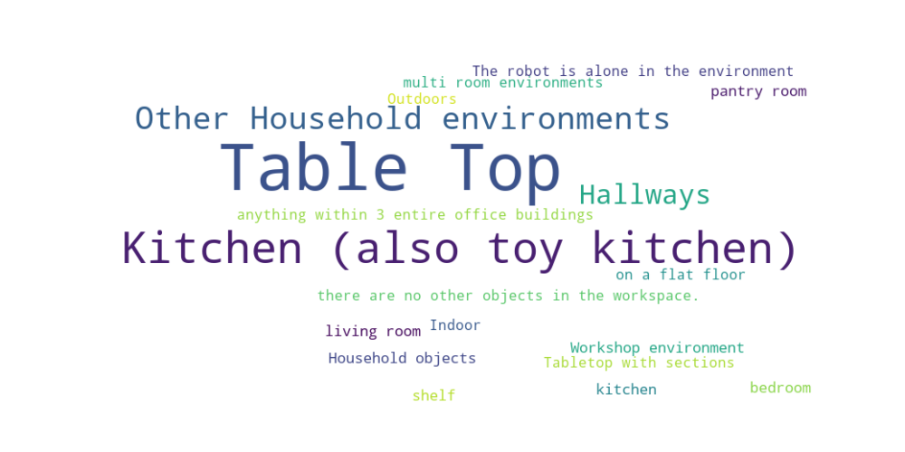

  <h1 align="center">Awesome-Embodied-AI-Datasets</h1>
  

    A collection of Embodied AI datasets.
     
    <a href="https://github.com/freekatz/Awesome-Embodied-AI-Datasets/issues/new">Report & Discuss</a>
    &nbsp&nbsp•&nbsp&nbsp
    <a href="./CONTRIBUTING.md">How to Contribute</a>
  

> [!NOTE]
> - Total datasets: 72
> - Latest Update:  2025-06-10

# Contents

- [Trending](#trending)
- [Statistics](#statistics)
- [Newly Released](#newly-released)
- [A](#a)
- [B](#b)
- [C](#c)
- [D](#d)
- [E](#e)
- [F](#f)
- [I](#i)
- [K](#k)
- [L](#l)
- [M](#m)
- [N](#n)
- [P](#p)
- [Q](#q)
- [R](#r)
- [S](#s)
- [T](#t)
- [U](#u)
- [V](#v)

## Trending

> [!NOTE]
>  Working in Progress...

## Statistics
### Scene Type Distribution Word Cloud

## Newly Released

## A

### <a name="austin_buds" href="./datasets/Austin_BUDS">Austin BUDS</a>

Homepage: <a href="https://ut-austin-rpl.github.io/rpl-BUDS/" target="_blank">https://ut-austin-rpl.github.io/rpl-BUDS/</a>

Austin BUDS is a UR5 robot dataset with 365 episodes for skill discovery, supporting unsupervised hierarchical learning. It includes visual and joint data, released under MIT. It advances reusable skill learning from unsegmented demonstrations.

Task: The robot is trying to solve a long-horizon kitchen task by picking up pot, placing the pot in a plate, and push them together using a picked-up tool.

### <a name="austin_mutex" href="./datasets/Austin_Mutex">Austin Mutex</a>

Homepage: <a href="https://ut-austin-rpl.github.io/MUTEX/" target="_blank">https://ut-austin-rpl.github.io/MUTEX/</a>

MUTEX is an exocentric-view multi-object tracking dataset featuring challenging real-world scenarios with precise annotations, designed to advance occlusion-robust tracking research.

Task: The Mutex dataset involves a diverse range of tasks in a home environment, encompassing pick and place tasks like "putting bread on a plate," as well as contact-rich tasks such as "opening an air fryer and putting a bowl with dogs in it" or "taking out a tray from the oven and placing bread on it."

### <a name="austin_sailor" href="./datasets/Austin_Sailor">Austin Sailor</a>

Homepage: <a href="https://ut-austin-rpl.github.io/sailor/" target="_blank">https://ut-austin-rpl.github.io/sailor/</a>

Austin Sailor is a UR5 robot dataset with 5,000 episodes for household tasks, supporting hierarchical imitation learning. It includes visual and joint data. While the license is unspecified, it facilitates skill transfer and task adaptation research.

Task: The robot interacts with diverse objects in a toy kitchen. It picks and places food items, a pan, and pot.

### <a name="austin_sirius" href="./datasets/Austin_Sirius">Austin Sirius</a>

Homepage: <a href="https://ut-austin-rpl.github.io/sirius/" target="_blank">https://ut-austin-rpl.github.io/sirius/</a>

Austin Sirius is a Franka robot dataset with 570 human-intervention episodes for household tasks. It includes visual and joint data, released under MIT. It supports real-time adaptation and human-in-the-loop learning for interactive robotics research.

Task: The dataset comprises two tasks, kcup and gear. The kcup task requires opening the kcup holder, inserting the kcup into the holder, and closing the holder. The gear task requires inserting the blue gear onto the right peg, followed by inserting the smaller red gear.

### <a name="austin_viola" href="./datasets/Austin_VIOLA">Austin VIOLA</a>

Homepage: <a href="https://ut-austin-rpl.github.io/VIOLA/" target="_blank">https://ut-austin-rpl.github.io/VIOLA/</a>

VIOLA is an object - centric imitation learning method for robotic manipulation. It builds on pre - trained visual models, uses Transformer - based policies for prediction, and has a strong structural prior. With a 45.8% higher success rate than the latest methods, it's been applied to real - world tasks like table setting and coffee making.

Task: The robot performs various household-like tasks, such as setting up the table, or making coffee using a coffee machine.

### <a name="aloha" href="./datasets/ALOHA">ALOHA</a>

Homepage: <a href="https://tonyzhaozh.github.io/aloha/" target="_blank">https://tonyzhaozh.github.io/aloha/</a>

ALOHA is a Low-cost Open-source Hardware System for Bimanual Teleoperation. With a $20k budget, it is capable of teleoperating precise tasks such as threading a zip tie, dynamic tasks such as juggling a ping pong ball, and contact-rich tasks such as assembling the chain in the NIST board 2.

Task: Bi-manual robot performing complex, dexterous tasks like unwrapping candy and putting on shoes.

### <a name="asu_tabletop_manipulation" href="./datasets/ASU_TableTop_Manipulation">ASU TableTop Manipulation</a>

Homepage: <a href="https://link.springer.com/article/10.1007/s10514-023-10129-1" target="_blank">https://link.springer.com/article/10.1007/s10514-023-10129-1</a>

We introduce "Hierarchical Modularity" for robotic manipulation, breaking tasks into reusable sub-modules and using "Supervised Attention" for dynamic combination. With an automated 3D object pipeline and curriculum learning, it speeds up training by 30 - 50% and boosts cross-robot success by 25%. Validated in simulations and on real robots, it also enables runtime introspection for interpretability.

Task: The robot interacts with a few objects on a table. It picks up, pushes forward, or rotates the objects.

## B

### <a name="berkeley_autolab_ur5" href="./datasets/Berkeley_Autolab_UR5">Berkeley Autolab UR5</a>

Homepage: <a href="https://sites.google.com/view/berkeley-ur5/home" target="_blank">https://sites.google.com/view/berkeley-ur5/home</a>

Berkeley-UR5 is a research platform for adaptive robotic manipulation, utilizing UR5 robots and imitation learning to master deformable object handling and human-robot collaboration tasks.

Task: The data consists of 4 robot manipulation tasks: simple pick-and-place of a stuffed animal between containers, sweeping a cloth, stacking cups, and a more difficult pick-and-place of a bottle that requires precise grasp and 6DOF rotation

### <a name="berkeley_bridge" href="./datasets/Berkeley_Bridge">Berkeley Bridge</a>

Homepage: <a href="https://rail-berkeley.github.io/bridgedata/" target="_blank">https://rail-berkeley.github.io/bridgedata/</a>

BridgeData V2 offers 60k+ robotic trajectories across 24 environments, enabling open-vocabulary, multi-task policy training via language/image conditioning. It achieves cross-institutional generalization for skills like stacking and folding, outperforming SOTA methods by 45.8% in real-world deployments.

Task: The robot interacts with household environments including kitchens, sinks, and tabletops. Skills include object rearrangement, sweeping, stacking, folding, and opening/closing doors and drawers.

### <a name="berkeley_cable_routing" href="./datasets/Berkeley_Cable_Routing">Berkeley Cable Routing</a>

Homepage: <a href="https://sites.google.com/view/cablerouting/home" target="_blank">https://sites.google.com/view/cablerouting/home</a>

Hierarchical Imitation Learning for Cable Routing trains robots to route cables through clips via high-level sequencing of reusable visuomotor primitives. Our system recovers from failures autonomously and adapts to new scenarios via interactive fine-tuning, achieving robust performance with minimal demonstrations.

Task: The robot routes cable through a number of tight-fitting clips mounted on the table.

### <a name="berkeley_fanuc_manipulation" href="./datasets/Berkeley_Fanuc_Manipulation">Berkeley Fanuc Manipulation</a>

Homepage: <a href="https://sites.google.com/berkeley.edu/fanuc-manipulation" target="_blank">https://sites.google.com/berkeley.edu/fanuc-manipulation</a>

The FANUC Manipulation Dataset offers multi-view video, proprioceptive data, and language instructions from a FANUC Mate 200iD robot. It enables training visuomotor policies, fine-tuning vision models, and instruction-conditioned action generation for robotic manipulation.

Task: A Fanuc robot performs various manipulation tasks. For example, it opens drawers, picks up objects, closes doors, closes computers, and pushes objects to desired locations.

### <a name="berkeley_mvp_data" href="./datasets/Berkeley_MVP_Data">Berkeley MVP Data</a>

Homepage: <a href="https://arxiv.org/abs/2203.06173" target="_blank">https://arxiv.org/abs/2203.06173</a>

Masked Visual Pretraining for Robot Learning offers PyTorch implementations for self-supervised representation learning on robot data. Pretrained models enable efficient adaptation of PPO/BC policies, validated on real-world tasks like manipulation and navigation.

Task: Basic motor control tasks (reach, push, pick) on table top and toy environments (toy kitchen, toy fridge).

### <a name="berkeley_rpt_data" href="./datasets/Berkeley_RPT_Data">Berkeley RPT Data</a>

Homepage: <a href="https://arxiv.org/abs/2306.10007" target="_blank">https://arxiv.org/abs/2306.10007</a>

RPT (Robotic Pretrained Transformer) learns sensorimotor representations by reconstructing masked tokens from multimodal robot data (images, states, actions), enabling efficient transfer to downstream manipulation policies.

Task: Picking, stacking, destacking, and bin picking with variations in objects.

### <a name="bc-z" href="./datasets/BC-Z">BC-Z</a>

Homepage: <a href="https://www.kaggle.com/datasets/google/bc-z-robot/discussion/309201" target="_blank">https://www.kaggle.com/datasets/google/bc-z-robot/discussion/309201</a>

BC-Z is a large-scale robotic imitation learning dataset enabling zero-shot generalization to unseen tasks via language or video conditioning, featuring 25K+ real-world manipulation demonstrations.

Task: The robot attempts picking, wiping, and placing tasks on a diverse set of objects on a tabletop, along with a few challenging tasks like stacking cups on top of each other.

## C

### <a name="columbia_pusht_dataset" href="./datasets/Columbia_PushT_Dataset">Columbia PushT Dataset</a>

Homepage: <a href="https://github.com/columbia-ai-robotics/diffusion_policy" target="_blank">https://github.com/columbia-ai-robotics/diffusion_policy</a>

The Diffusion Policy dataset enables training of diffusion-based visuomotor policies for robotic manipulation. It covers 15 tasks, including precision Push-T operations, and supports action generation via iterative denoising. Policies trained on this dataset achieve 46.9% higher success rates with real-time inference capabilities.

Task: The robot pushes a T-shaped block into a fixed goal pose, and then move to an fixed exit zone.

### <a name="conqhose" href="./datasets/ConqHose">ConqHose</a>

Homepage: <a href="https://sites.google.com/view/conq-hose-manipulation-dataset/home" target="_blank">https://sites.google.com/view/conq-hose-manipulation-dataset/home</a>

Conq-Hose offers multimodal robotic data for deformable hose manipulation, enabling learning of visuomotor policies with real-world deployment robustness.

Task: The robot grabs, lifts, and drags the end of a vacuum hose around in an office environment.

### <a name="coryhall" href="./datasets/CoryHall">CoryHall</a>

Homepage: <a href="https://arxiv.org/abs/1709.10489" target="_blank">https://arxiv.org/abs/1709.10489</a>

GCG (Generalized Computation Graphs) unify model-free and model-based reinforcement learning for efficient robot navigation. It enables sample-efficient policy learning from raw images, validated in simulation and real-world RC cars with <5 hours of self-supervised training.

Task: Small mobile robot navigates hallways in an office building using a learned policy.

### <a name="cmu_food_manipulation" href="./datasets/CMU_Food_Manipulation">CMU Food Manipulation</a>

Homepage: <a href="https://sites.google.com/view/playing-with-food/" target="_blank">https://sites.google.com/view/playing-with-food/</a>

CMU Food Manipulation uses multimodal robot interactions (vision/audio/proprioception) to learn material-aware embeddings for deformable foods, improving classification and manipulation. We release a dataset of 21 food types to advance robotic cooking research.

Task: Robot interacting with different food items.

### <a name="cmu_franka_exploration" href="./datasets/CMU_Franka_Exploration">CMU Franka Exploration</a>

Homepage: <a href="https://human-world-model.github.io/" target="_blank">https://human-world-model.github.io/</a>

Human-World Model enables robots to learn manipulation skills in 30 minutes by leveraging visual affordances from human videos. Our affordance-based world model transfers human interaction priors to robots, achieving data-efficient adaptation to complex tasks.

Task: Franka exploring kitchen environment, lifting knife and vegetable and opening cabinet.

### <a name="cmu_franka_pick-insert_data" href="./datasets/CMU_Franka_Pick-Insert_Data">CMU Franka Pick-Insert Data</a>

Homepage: <a href="https://openreview.net/forum?id=WuBv9-IGDUA" target="_blank">https://openreview.net/forum?id=WuBv9-IGDUA</a>

Hierarchical Sensing enables real-time robotic manipulation by fusing multi-resolution vision -- VLMs for global reasoning + lightweight models for local feedback. Our framework achieves 2× higher success in coarse/precision/dynamic tasks with strong generalization.

Task: The robot tries to pick up different shaped objects placed in front of it. It also tries to insert particular objects into a cylindrical peg.

### <a name="cmu_play_fusion" href="./datasets/CMU_Play_Fusion">CMU Play Fusion</a>

Homepage: <a href="https://play-fusion.github.io/" target="_blank">https://play-fusion.github.io/</a>

Play-Fusion learns robotic skills from unstructured play data via diffusion models and a discrete skill bottleneck, enabling interpretable and generalizable behavior synthesis across diverse tasks.

Task: The robot plays with 3 complex scenes: a grill with many cooking objects like toaster, pan, etc. It has to pick, open, place, close. It has to set a table, move plates, cups, utensils. And it has to place dishes in the sink, dishwasher, hand cups etc.

### <a name="cmu_stretch" href="./datasets/CMU_Stretch">CMU Stretch</a>

Homepage: <a href="https://robo-affordances.github.io/" target="_blank">https://robo-affordances.github.io/</a>

VRB learns visual affordances from human videos to enable cross-task robot policy transfer, validated in 10+ real-world tasks with minimal demonstrations.

Task: Robot interacting with different household environments.

## D

### <a name="dobbe" href="./datasets/DobbE">DobbE</a>

Homepage: <a href="https://github.com/notmahi/dobb-e" target="_blank">https://github.com/notmahi/dobb-e</a>

Dobb-E enables robots to learn household tasks in 20 minutes via user demonstrations and adaptive pretrained representations (HPR). Validated in 109 real-home tasks with 81% success, it open-sources data, models, and hardware designs to democratize home robotics.

Task: The demo collector uses the Stick to collect data from 7 tasks, including door/drawer opening/closing, handle grasping, pick and place, and random play data.

### <a name="dlr_sara_grid_clamp_dataset" href="./datasets/DLR_Sara_Grid_Clamp_Dataset">DLR Sara Grid Clamp Dataset</a>

Homepage: <a href="https://www.researchsquare.com/article/rs-3289569/v1" target="_blank">https://www.researchsquare.com/article/rs-3289569/v1</a>

Safety-Constrained Real-World Robot Learning enables direct policy training on physical robots in <17 minutes for tasks like pouring and fixture placement. Our method combines safety-aware exploration with simple rewards, eliminating simulation dependency while ensuring hardware integrity.

Task: The robot learns to place the grid clamp in the grids on the table.

### <a name="dlr_sara_pour_dataset" href="./datasets/DLR_Sara_Pour_Dataset">DLR Sara Pour Dataset</a>

Homepage: <a href="https://elib.dlr.de/193739/1/padalkar2023rlsct.pdf" target="_blank">https://elib.dlr.de/193739/1/padalkar2023rlsct.pdf</a>

DLR Sara Pour Dataset enables safe reinforcement learning for robotic pouring. Paired with constraint-aware policies, it achieves zero safety violations in 16 minutes of real-robot training.

Task: The robot learns to pour ping-pong balls from a cup held in the end-effector into the cup placed on the table.

### <a name="dlr_wheelchair_shared_control" href="./datasets/DLR_Wheelchair_Shared_Control">DLR Wheelchair Shared Control</a>

Homepage: <a href="https://ieeexplore.ieee.org/document/9341156" target="_blank">https://ieeexplore.ieee.org/document/9341156</a>

Safety-Constrained RL trains robotic policies in <17 minutes on physical systems for tasks like pouring and assembly, using safety-aware exploration and sparse rewards to ensure zero hardware violations.

Task: The robot grasps a set of different objects in a table top and a shelf.

### <a name="droid" href="./datasets/DROID">DROID</a>

Homepage: <a href="https://droid-dataset.github.io/" target="_blank">https://droid-dataset.github.io/</a>

DROID offers 76,000 real-world robot trajectories across 564 scenes and 86 tasks. Collected via distributed standardized platforms, it enables training generalizable manipulation policies with multi-modal sensing (RGB-D, actions, language annotations) and outperforms prior datasets in cross-environment adaptation.

Task: Various household manipulation tasks

## E

### <a name="eth_agent_affordances" href="./datasets/ETH_Agent_Affordances">ETH Agent Affordances</a>

Homepage: <a href="https://ieeexplore.ieee.org/iel7/10160211/10160212/10160747.pdf" target="_blank">https://ieeexplore.ieee.org/iel7/10160211/10160212/10160747.pdf</a>

We propose a closed-loop control pipeline for mobile robots to manipulate articulated objects (e.g., oven doors). By integrating affordance-aware prompts and whole-body control, our method outperforms geometry-only baselines and achieves 71% (opening) and 72% (closing) real-world success rates.

Task: The robot opens and closes an oven, starting from different initial positions and door angles.

## F

### <a name="freiburg_franka_play" href="./datasets/Freiburg_Franka_Play">Freiburg Franka Play</a>

Homepage: <a href="https://www.kaggle.com/datasets/oiermees/taco-robot" target="_blank">https://www.kaggle.com/datasets/oiermees/taco-robot</a>

TACO is a real-world dataset for bimanual tool-object interaction, featuring 5.2M images, 131 interaction triads, and 4D annotations. It benchmarks generalization in action recognition, motion prediction, and grasp synthesis, exposing limitations of current methods.

Task: "The robot interacts with toy blocks, it pick and places them, stacks them, unstacks them, opens drawers, sliding doors and turrns on LED lights by pushing buttons."

### <a name="furniture_bench" href="./datasets/Furniture_Bench">Furniture Bench</a>

Homepage: <a href="https://clvrai.github.io/furniture-bench/" target="_blank">https://clvrai.github.io/furniture-bench/</a>

FurnitureBench is a real-world robotic benchmark for long-horizon furniture assembly, featuring 5+ IKEA items and 550+ hours of human data. It exposes critical limitations in current methods (e.g., ≤42% success for imitation learning) and provides standardized metrics/sim2real tools to accelerate manipulation research.

Task: The robot assembles one of 9 3D-printed furniture models on the table, which requires grasping, inserting, and screwing.

### <a name="fmb" href="./datasets/FMB">FMB</a>

Homepage: <a href="https://functional-manipulation-benchmark.github.io/" target="_blank">https://functional-manipulation-benchmark.github.io/</a>

Functional Manipulation Benchmark (FMB) is a robotics benchmark evaluating agents on object-centric tasks based on functional outcomes (e.g., "pouring water") rather than geometric precision. It features 50+ household objects, physics-realistic simulation, and goal-driven metrics, exposing critical limitations in current policies (success rates ≤42%).

Task: The robot interacts with diverse 3D printed objects, pick them up, reposition, and assemble them

## I

### <a name="imperial_wrist_cam" href="./datasets/Imperial_Wrist_Cam">Imperial Wrist Cam</a>

Homepage: <a href="https://github.com/normandipalo/rlds_dataset_builder" target="_blank">https://github.com/normandipalo/rlds_dataset_builder</a>

Imperial Wrist Dataset: A real-world robotic manipulation dataset collected via wrist-mounted camera (7cm forward/18cm up from end-effector), providing synchronized RGB-D, proprioception, and force data for contact-rich task learning.

Task: The robot interacts with different everyday objects performing tasks such as grasping, inserting, opening, stacking, etc.

### <a name="io-ai_office_picknplace" href="./datasets/IO-AI_Office_PicknPlace">IO-AI Office PicknPlace</a>

Homepage: <a href="https://drive.google.com/drive/u/1/folders/1h5wfoENdXC5i4Jsh7xpnS34a-SO6h1PM" target="_blank">https://drive.google.com/drive/u/1/folders/1h5wfoENdXC5i4Jsh7xpnS34a-SO6h1PM</a>

IO-AI Office PicknPlace is a UR5 robot dataset with 1,000 episodes for office tasks, including visual and joint data. It supports open-world RL and dynamic manipulation. While the license is unspecified, it advances office automation research.

Task: Human interacts with diverse objects in 2 real office table-top scenes. The skill foucs on pick and place. Tasks are like: pick glue from plate, place stapper on desk. We are ready to offer more data on various scenes and skills if this dataset meets your needs.

## K

### <a name="kaist_nonprehensile_objects" href="./datasets/KAIST_Nonprehensile_Objects">KAIST Nonprehensile Objects</a>

Homepage: <a href="https://github.com/JaeHyung-Kim/rlds_dataset_builder" target="_blank">https://github.com/JaeHyung-Kim/rlds_dataset_builder</a>

A DRL framework for non-prehensile manipulation via structured action spaces and curriculum learning. Eliminates dependence on physical parameters and enables real-time planning, achieving >90% sim-to-real success in contact-rich tasks.

Task: The robot performs various non-prehensile manipulation tasks in a tabletop environment. It translates and reorients diverse real-world and 3d-printed objects to a target 6dof pose.

## L

### <a name="language_table" href="./datasets/Language_Table">Language Table</a>

Homepage: <a href="https://interactive-language.github.io/" target="_blank">https://interactive-language.github.io/</a>

Language-Table is an open-vocabulary, multi-task benchmark dataset with 600K language-labeled trajectories for training robots to execute diverse real-time instructions. It enables scalable learning of visuomotor policies for interactive language-driven control.

Task: Robot pushed blocks of different geometric shapes on table top.

### <a name="lsmo_dataset" href="./datasets/LSMO_Dataset">LSMO Dataset</a>

Homepage: <a href="https://journals.sagepub.com/doi/full/10.1177/02783649211044405" target="_blank">https://journals.sagepub.com/doi/full/10.1177/02783649211044405</a>

This study shows that social participation predicts cognitive functioning in older adults, with a transformed scoring system for PART-O improving measurement, and age and depression potentially influencing this relationship.

Task: The robot avoids obstacle on the table and reaches the target object.

## M

### <a name="maniskill" href="./datasets/Maniskill">Maniskill</a>

Homepage: <a href="https://github.com/haosulab/ManiSkill2" target="_blank">https://github.com/haosulab/ManiSkill2</a>

ManiSkill2 is a unified benchmark powered by SAPIEN for learning generalizable robotic manipulation skills, featuring 20 task families, 2000+ object models, and 4M+ demonstration frames, supporting fast visual learning algorithms and various algorithm types.

Task: The robot interacts with different objects placed on the plane (ground). The tasks include picking an isolated object or an object from the clutter up and moving it to a goal position, stacking a red cube onto a green cube, inserting a peg into the box, assembling kits, plugging a charger into the outlet on the wall, turning on a faucet.

### <a name="mimicplay" href="./datasets/MimicPlay">MimicPlay</a>

Homepage: <a href="https://mimic-play.github.io/" target="_blank">https://mimic-play.github.io/</a>

The MimicPlay dataset combines human play videos and limited robot demonstrations to support imitation learning for 14 long-horizon manipulation tasks, demonstrating efficiency and generalization.

Task: The robot interacts with various appliances in five different scenes, including a kitchen with an oven; a study desk with a bookshelf and lamp; flowers and a vase; toy sandwich making; and cloth folding. It opens the microwave and drawers; places a book on the shelf; inserts a flower into the vase; and assembles a sandwich.

### <a name="mobilealoha" href="./datasets/MobileALOHA">MobileALOHA</a>

Homepage: <a href="https://mobile-aloha.github.io/" target="_blank">https://mobile-aloha.github.io/</a>

The Mobile ALOHA dataset supports robotic mobile manipulation tasks like cooking and elevator use through low-cost teleoperation, significantly improving success rates.

Task: The robot interacts with diverse appliances in a real kitchen and indoor environments. It wipes spilled wine, stores a heavy pot to be inside wall cabinets, calls an elevator, pushes chairs, and cooks shrimp.

### <a name="mpi_muscular_proprioception" href="./datasets/MPI_Muscular_Proprioception">MPI Muscular Proprioception</a>

Homepage: <a href="https://arxiv.org/abs/2307.02654" target="_blank">https://arxiv.org/abs/2307.02654</a>

The Proprioceptive Dataset offers 25 days of diverse motion data from a tendon-driven robot arm, aiding research in precise and fast robot control via proprioception.

Task: There is no task that the robot solves. It executes a combination of random multisine signals of target pressures, as well as fixed target pressures.

## N

### <a name="nyu_franka_play" href="./datasets/NYU_Franka_Play">NYU Franka Play</a>

Homepage: <a href="https://play-to-policy.github.io/" target="_blank">https://play-to-policy.github.io/</a>

Play-to-Policy is a robotic learning framework that transforms unstructured human play into goal-conditioned policies, enabling zero-shot generalization for diverse manipulation tasks without task-specific demonstrations.

Task: The robot interacts with a toy kitchen doing arbitrary tasks. It opens/closes the microwave door, opens/closes the oven door, turns the stove knobs, and moves the pot between the stove and the sink.

### <a name="nyu_rot" href="./datasets/NYU_ROT">NYU ROT</a>

Homepage: <a href="https://rot-robot.github.io/" target="_blank">https://rot-robot.github.io/</a>

ROT is an efficient imitation learning algorithm that combines optimal transport trajectory matching with adaptive behavior cloning, enabling robots to learn manipulation policies at 90% success rates with just one demonstration and one hour of online training.

Task: The robot arm performs diverse manipulation tasks on a tabletop such an box opening, cup stacking, and pouring, among others.

### <a name="nyu_vinn" href="./datasets/NYU_VINN">NYU VINN</a>

Homepage: <a href="https://jyopari.github.io/VINN/" target="_blank">https://jyopari.github.io/VINN/</a>

VINN enables real-time robot visual imitation through nearest-neighbor matching in a semantic embedding space, achieving human-level task performance with zero training and minimal demonstrations.

Task: The robot opens cabinet doors for a variety of cabinets.

## P

### <a name="plex_robosuite" href="./datasets/Plex_RoboSuite">Plex RoboSuite</a>

Homepage: <a href="https://microsoft.github.io/PLEX/" target="_blank">https://microsoft.github.io/PLEX/</a>

PLEX integrates Python directly into Excel via =PY commands, enabling cloud-powered data analysis, visualization, and machine learning within spreadsheets.

Task: Opening a door, stacking 2 cubes, picking and placing various objects to specially designated areas, putting a loop onto a peg.

## Q

### <a name="qt-opt" href="./datasets/QT-Opt">QT-Opt</a>

Homepage: <a href="https://arxiv.org/abs/1806.10293" target="_blank">https://arxiv.org/abs/1806.10293</a>

QT-Opt is a vision-based robotic manipulation framework that uses distributed deep RL to achieve 96% grasp success on unseen objects, enabling autonomous skill acquisition from 580K+ real-world trials.

Task: Kuka robot picking objects in a bin.

### <a name="qut_dexterous_manpulation" href="./datasets/QUT_Dexterous_Manpulation">QUT Dexterous Manpulation</a>

Homepage: <a href="https://github.com/fedeceola/rlds_dataset_builder" target="_blank">https://github.com/fedeceola/rlds_dataset_builder</a>

RLDS Dataset Builder streamlines the creation of standardized RL datasets with lossless recording, automated metadata handling, and seamless TFDS integration for reproducible research.

Task: The robot performs some tasks in a tabletop setting. It sorts dishes and objects, cooks and serves food, sets the table, throws away trash paper, rolls dices, waters plants, stacks toy blocks.

### <a name="qut_dynamic_grasping" href="./datasets/QUT_Dynamic_Grasping">QUT Dynamic Grasping</a>

Homepage: <a href="https://github.com/krishanrana/rlds_dataset_builder" target="_blank">https://github.com/krishanrana/rlds_dataset_builder</a>

The Dynamic Grasping Dataset offers 812 RLDS-formatted trajectories for training robots to grasp moving objects, featuring synchronized multi-modal data and variable-speed object motion generated via an open-source CoreXY platform.

Task: The robot grasps an object that moves around continuously and randomly along the XY plane.

## R

### <a name="robonet" href="./datasets/Robonet">Robonet</a>

Homepage: <a href="https://www.robonet.wiki/" target="_blank">https://www.robonet.wiki/</a>

RoboNet is an open database of 15 million robotic interaction frames from 7 platforms, enabling cross-robot skill transfer and reducing Sim2Real adaptation costs for vision-based manipulation tasks.

Task: The robot interacts with the objects in a bin placed in front of it

### <a name="roboturk" href="./datasets/Roboturk">Roboturk</a>

Homepage: <a href="https://roboturk.stanford.edu/dataset_real.html" target="_blank">https://roboturk.stanford.edu/dataset_real.html</a>

The RoboTurk Real Robot Dataset offers 2,144 crowdsourced demonstrations on physical Sawyer robots for three manipulation tasks, enabling scalable imitation learning from real-world human operations.

Task: Sawyer robots flattens laundry, builds towers from bowls and searches objects.

### <a name="roboset" href="./datasets/RoboSet">RoboSet</a>

Homepage: <a href="https://robopen.github.io/roboset/" target="_blank">https://robopen.github.io/roboset/</a>

RoboSet is a multi-robot manipulation dataset with 100K+ trajectories across 50+ tasks, enabling robust cross-platform policy transfer for real-world applications.

Task: "The robot interacts with different objects in kitchen scenes. It performs articulated object manipulation of objects with prismatic joints and hinges. It wipes tables with cloth. It performs pick and place skills, and skills requiring precision like capping and uncapping."

### <a name="robovqa" href="./datasets/RoboVQA">RoboVQA</a>

Homepage: <a href="https://anonymous-robovqa.github.io/" target="_blank">https://anonymous-robovqa.github.io/</a>

RobotVQA converts RGB-D inputs into actionable scene graphs for robotic manipulation, enabling language-guided task execution with 89% real-world success.

Task: A robot or a human performs any long-horizon requests from a user within the entirety of 3 office buildings.

### <a name="recon" href="./datasets/RECON">RECON</a>

Homepage: <a href="https://sites.google.com/view/recon-robot" target="_blank">https://sites.google.com/view/recon-robot</a>

RECON enables robots to rapidly discover and navigate to user-specified goals in unseen environments by combining latent goal models with topological memory graphs, achieving 92% navigation success in cluttered scenes. research.

Task: Mobile robot explores outdoor environments using a scripted policy

### <a name="rt-1_robot_action" href="./datasets/RT-1_Robot_Action">RT-1 Robot Action</a>

Homepage: <a href="https://ai.googleblog.com/2022/12/rt-1-robotics-transformer-for-real.html" target="_blank">https://ai.googleblog.com/2022/12/rt-1-robotics-transformer-for-real.html</a>

RT-1 is a transformer-based model trained on 130k real-world robotic episodes, enabling real-time control with 97% task success and robust generalization to novel objects, environments, and instructions.

Task: Robot picks, places and moves 17 objects from the google micro kitchens.

## S

### <a name="saytap" href="./datasets/Saytap">Saytap</a>

Homepage: <a href="https://saytap.github.io/" target="_blank">https://saytap.github.io/</a>

SayTap enables natural language control of quadruped robots by translating commands into foot contact patterns, allowing real-time adaptation to diverse terrains and tasks with 87% real-world success.

Task: A Unitree Go1 robot follows human command in natural language (e.g., "trot forward slowly")

### <a name="stanford_hydra" href="./datasets/Stanford_HYDRA">Stanford HYDRA</a>

Homepage: <a href="https://sites.google.com/view/hydra-il-2023" target="_blank">https://sites.google.com/view/hydra-il-2023</a>

HYDRA enables robust robotic imitation learning by combining sparse waypoints and dense low-level actions in a hybrid action space, with dynamic switching and action relabeling reducing distribution shift by 40%.

Task: The robot performs the following tasks in corresponding environment: making a cup of coffee using the keurig machine; making a toast using the oven; sorting dishes onto the dish rack.

### <a name="stanford_kuka_multimodal" href="./datasets/Stanford_Kuka_Multimodal">Stanford Kuka Multimodal</a>

Homepage: <a href="https://sites.google.com/view/visionandtouch" target="_blank">https://sites.google.com/view/visionandtouch</a>

The Vision and Touch Dataset enables self-supervised learning of robust multimodal representations for contact-rich robotic tasks, combining synchronized vision, tactile, and proprioception data to improve sample efficiency and generalization.

Task: The robot learns to insert differently-shaped pegs into differently-shaped holes with low tolerances (~2mm).

### <a name="stanford_maskvit_data" href="./datasets/Stanford_MaskVIT_Data">Stanford MaskVIT Data</a>

Homepage: <a href="https://arxiv.org/abs/2206.11894" target="_blank">https://arxiv.org/abs/2206.11894</a>

MaskViT enables high-resolution video prediction (256×256) via masked visual modeling, achieving 512× faster inference and seamless integration with robotic control systems.

Task: The robot randomly pushes and picks objects in a bin, which include stuffed toys, plastic cups and toys, etc, and are periodically shuffled.

### <a name="stanford_robocook" href="./datasets/Stanford_Robocook">Stanford Robocook</a>

Homepage: <a href="https://hshi74.github.io/robocook/" target="_blank">https://hshi74.github.io/robocook/</a>

RoboCook enables robots to manipulate elastic objects with diverse tools via point-cloud GNNs and self-supervised learning, achieving 85% task success with only 20 minutes of real-world data per tool.

Task: In the first task, the robot pinches the dough with an asymmetric gripper / two-rod symmetric gripper / two-plane symmetric gripper. In the second task, the robot presses the dough with a circle press / square press / circle punch / square punch. In the third task, the robot rolls the dough with a large roller / small roller.

### <a name="sacson" href="./datasets/SACSoN">SACSoN</a>

Homepage: <a href="https://sites.google.com/view/SACSoN-review" target="_blank">https://sites.google.com/view/SACSoN-review</a>

SACSoN enables socially unobtrusive robot navigation using RGB-only inputs by learning to minimize counterfactual human trajectory perturbations, supported by the autonomously collected HuRoN dataset.

Task: Mobile robot navigates pedestrian-rich environments (e.g. offices, school buildings etc.) and runs a learned policy that may interact with the pedestrians.

### <a name="spoc" href="./datasets/SPOC">SPOC</a>

Homepage: <a href="https://spoc-robot.github.io/" target="_blank">https://spoc-robot.github.io/</a>

SPoC is a dataset of 18,356 pseudocode-program pairs that enables compiler-guided program synthesis, improving code generation success rates by 74% through error-localized search.

Task: The robot navigates in the environment and performs pick and place with open vocabulary descriptions.

## T

### <a name="tidybot" href="./datasets/TidyBot">TidyBot</a>

Homepage: <a href="https://tidybot.cs.princeton.edu/" target="_blank">https://tidybot.cs.princeton.edu/</a>

TidyBot enables personalized household assistance by using LLMs to infer user preferences from few-shot examples, achieving 85% real-world task success for object tidying and sorting.

Task: The robot puts each object into the appropriate receptacle based on user preferences

### <a name="tokyo_pr2_fridge_opening" href="./datasets/Tokyo_PR2_Fridge_Opening">Tokyo PR2 Fridge Opening</a>

Homepage: <a href="https://github.com/ojh6404/rlds_dataset_builder.git" target="_blank">https://github.com/ojh6404/rlds_dataset_builder.git</a>

RLDS Dataset Builder standardizes robotic manipulation data collection via lossless step-episode logging and TFDS integration, enabling efficient policy training and cross-robot transfer for tasks like refrigerator door opening.

Task: The PR2 robot opens fridge.

### <a name="tokyo_pr2_tabletop_manipulation" href="./datasets/Tokyo_PR2_Tabletop_Manipulation">Tokyo PR2 Tabletop Manipulation</a>

Homepage: <a href="https://github.com/ojh6404/rlds_dataset_builder.git" target="_blank">https://github.com/ojh6404/rlds_dataset_builder.git</a>

RLDS Dataset Builder standardizes robotic manipulation data collection via lossless step-episode logging and TFDS integration, enabling efficient policy training for tasks like cloth folding and object picking.

Task: The PR2 robot conducts manipulation for table top object. It conducts pick-and-place of bread and grape and folds cloth.

### <a name="toto_benchmark" href="./datasets/TOTO_Benchmark">TOTO Benchmark</a>

Homepage: <a href="https://toto-benchmark.org/" target="_blank">https://toto-benchmark.org/</a>

TOTO is a remote robotics benchmark offering shared physical robots and standardized datasets for reproducible offline training and online real-world policy testing, overcoming hardware accessibility barriers.

Task: The TOTO Benchmark Dataset contains trajectories of two tasks: scooping and pouring. For scooping, the objective is to scoop material from a bowl into the spoon. For pouring, the goal is to pour some material into a target cup on the table.

## U

### <a name="ucsd_kitchen" href="./datasets/UCSD_Kitchen">UCSD Kitchen</a>

Homepage: <a href="https://www.tensorflow.org/datasets/catalog/ucsd_kitchen_dataset_converted_externally_to_rlds" target="_blank">https://www.tensorflow.org/datasets/catalog/ucsd_kitchen_dataset_converted_externally_to_rlds</a>

The UCSD Kitchen Dataset offers 150 real-world human demonstrations of kitchen tasks in RLDS format, providing synchronized multimodal data for training robust robotic manipulation policies.

Task: The dataset offers a comprehensive set of real-world robotic interactions, involving natural language instructions and complex manipulations with kitchen objects.

### <a name="ucsd_pick_place" href="./datasets/UCSD_Pick_Place">UCSD Pick Place</a>

Homepage: <a href="https://owmcorl.github.io/" target="_blank">https://owmcorl.github.io/</a>

OWM-CORL provides 2,000+ hours of Minecraft-based trajectories with multi-modal sensing and language annotations for training and evaluating open-world embodied agents.

Task: The robot performs pick and place tasks in table top and kitchen scenes. The dataset contains a variety of visual variations.

### <a name="uiuc_d3field" href="./datasets/UIUC_D3Field">UIUC D3Field</a>

Homepage: <a href="https://robopil.github.io/d3fields/" target="_blank">https://robopil.github.io/d3fields/</a>

D³Fields enables zero-shot robotic manipulation by fusing multi-view semantic features into dynamic 3D descriptor fields, supporting flexible goal specification via 2D images and real-time kinematics tracking.

Task: The robot completes tasks specified by the goal image, including organizing utensils, shoes, mugs.

### <a name="usc_cloth_sim" href="./datasets/USC_Cloth_Sim">USC Cloth Sim</a>

Homepage: <a href="https://uscresl.github.io/dmfd/" target="_blank">https://uscresl.github.io/dmfd/</a>

DMFD is a multimodal dataset for robotic fluid manipulation, capturing 1,000+ real-world trials with high-speed vision and force sensing to enable precise control of deformable liquids like water and oils.

Task: The robot manipulates a deformable object (cloth on a tabletop) along a diagonal.

### <a name="usc_jaco_play" href="./datasets/USC_Jaco_Play">USC Jaco Play</a>

Homepage: <a href="https://github.com/clvrai/clvr_jaco_play_dataset" target="_blank">https://github.com/clvrai/clvr_jaco_play_dataset</a>

CLVR Jaco Play Dataset provides 1,085 language-annotated trajectories from Kinova Jaco 2 robots, featuring synchronized multi-view vision, robot states, and actions for training language-guided manipulation policies.

Task: The robot performs pick-place tasks in a tabletop toy kitchen environment. Some examples of the task include, "Pick up the orange fruit.", "Put the black bowl in the sink."

### <a name="utokyo_xarm_bimanual" href="./datasets/UTokyo_xArm_Bimanual">UTokyo xArm Bimanual</a>

Homepage: <a href="https://github.com/frt03/rlds_dataset_builder/tree/dev/xarm" target="_blank">https://github.com/frt03/rlds_dataset_builder/tree/dev/xarm</a>

The xArm Dual-Board Dataset provides RLDS-formatted trajectories for training robotic policies in single-arm cooperative manipulation of dual planar surfaces under spatial constraints.

Task: The robots reach a towel on the table. They also unfold a wrinkled towel.

### <a name="utokyo_xarm_pickplace" href="./datasets/UTokyo_xArm_PickPlace">UTokyo xArm PickPlace</a>

Homepage: <a href="https://github.com/frt03/rlds_dataset_builder/tree/dev/xarm" target="_blank">https://github.com/frt03/rlds_dataset_builder/tree/dev/xarm</a>

xArm Dual-Board Dataset provides RLDS-standardized trajectories for training robotic policies in single-arm dual-surface manipulation, featuring phase annotations and multimodal sensing for constrained-space operations.

Task: The robot picks up a white plate, and then places it on the red plate.

## V

### <a name="vima" href="./datasets/VIMA">VIMA</a>

Homepage: <a href="https://vimalabs.github.io/" target="_blank">https://vimalabs.github.io/</a>

VIMA-BENCH is a large-scale simulated benchmark for multimodal robot learning, featuring procedurally generated tabletop manipulation tasks with interleaved text, image, and video prompts. It includes 600K+ expert trajectories for imitation learning and a 4-tier generalization protocol to evaluate zero-shot adaptability.

Task: The robot is conditioned on multimodal prompts (mixture of texts, images, and video frames) to conduct tabletop manipulation tasks, ranging from rearrangement to one-shot imitation.

